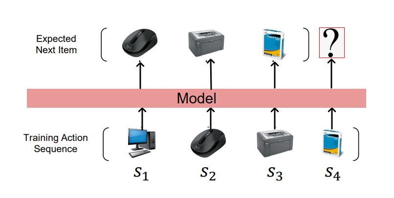
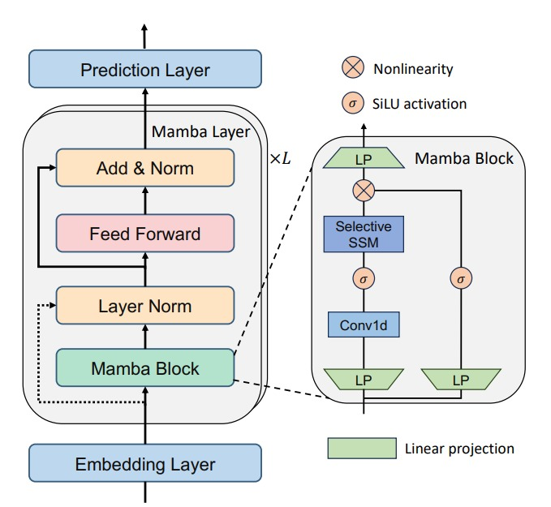
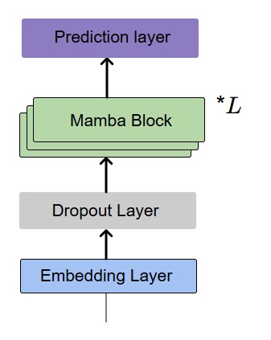
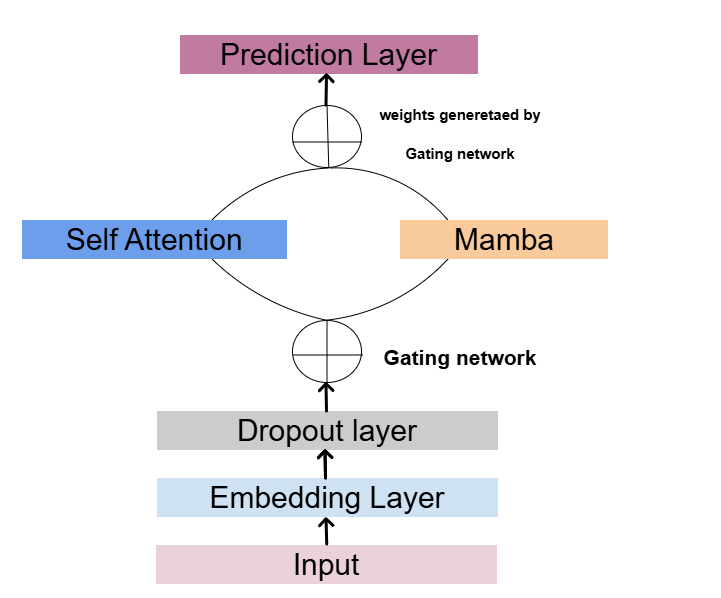

# State-Space Models for Large Sequence Modeling in Sequential Recommendation

### Author: Alokam Gnaneswara Sai  
  

---

## Abstract

This project focuses on enhancing sequential recommendation systems using **Mamba**, a state-space model. The work aims to address challenges with handling long sequences in traditional methods, such as slow inference and higher training costs. The proposed solutions achieve faster inference, reduced training times, and improved accuracy compared to Transformer-based models like SASRec.

[GitHub Repository](https://github.com/alokamgnaneswarasai/MambaRec.git)

---

## Introduction

Sequential recommendation systems are critical for applications such as e-commerce, video streaming, and music platforms. This work explores state-space models to efficiently capture long-range dependencies and proposes a hybrid approach combining **Mamba** and self-attention mechanisms.  

  
*Figure 1: Training process for a sequential recommendation system.*

---

## Problem Statement

The task is to predict the next item a user will interact with based on their historical interactions. Formally, the goal is to learn a function:  

$$f: (s_u, u) \to P(i_{t+1} | s_u, u; \Theta)$$,  

where $s_u$ is the interaction sequence and $\Theta$ are model parameters.

---

## Methodology

### 1. **Replacing Self-Attention with the Mamba Block**  
The Mamba block substitutes the self-attention mechanism within a standard Transformer block.  
  
*Figure 2: Architecture for replacing self-attention.*

### 2. **Replacing the Entire Transformer Block**  
The Mamba block replaces the entire Transformer block, including feedforward layers.  
  
*Figure 3: Architecture for replacing the Transformer block.*

### 3. **Hybrid Approach**  
A mixture of self-attention and Mamba blocks, regulated by a gating network, is proposed for handling both short and long sequences.  
  
*Figure 4: Hybrid model combining self-attention and Mamba.*

---

## Experiments

### Datasets
Three datasets were used:  
- **LFM-1b**: Last.fm listening histories.  
- **KuaiRand**: Short-video interaction data.  
- **ML-1M**: MovieLens 1M ratings dataset.  

| **Statistic**          | **LFM-1b**        | **KuaiRand**    | **ML-1M**         |
|-------------------------|-------------------|-----------------|-------------------|
| Number of users         | 120,322           | 27,285          | 6,040             |
| Number of items         | 31,634,450        | 32,038,725      | 3,952             |
| Number of interactions  | 1,088,161,692     | 322,278,385     | 100,209           |
| Average sequence length | 9,043             | 11,811          | 165               |

*Table 1: Statistics of the LFM-1b, KuaiRand, and ML-1M datasets.*

 
## Evaluation Metrics

To evaluate the performance of the proposed recommendation system, two widely recognized Top-N metrics are utilized: **Hit Rate@K (HR@K)** and **Normalized Discounted Cumulative Gain@K (NDCG@K)**.

### Hit Rate@K (HR@K)

Hit Rate@K quantifies the proportion of instances where the ground-truth next item is present within the top $K$ recommended items. For a dataset consisting of $N$ users, HR@K is defined as:

$$
HR@K = \frac{1}{N} \sum_{i=1}^{N} \mathbb{I}(y_i \in \mathcal{R}_i^K)
$$

where:
- $y_i$ represents the ground-truth next item for user $i$,
- $\mathcal{R}_i^K$ denotes the set of top $K$ recommended items for user $i$,
- $\mathbb{I}(\cdot)$ is the indicator function.

### Normalized Discounted Cumulative Gain@K (NDCG@K)

NDCG@K evaluates the ranking quality of recommended items by assigning higher importance to items ranked closer to the top:

$$
NDCG@K = \frac{1}{N} \sum_{i=1}^{N} \frac{\mathbb{I}(y_i \in \mathcal{R}_i^K)}{\log_2(\text{rank}_i(y_i) + 1)}
$$

where:
- $\text{rank}_{i}(y_i)$ represents the position of the ground-truth item $y_i$.

These metrics provide an evaluation framework that captures both recommendation accuracy and ranking quality.

*Table 2: Performance metrics across datasets.*

---

## Results
| **Dataset**       | **Metric**  | **GRU4Rec** | **SASRec** | **RecMamba** | **MambaRec*** | **MoEMaTrRec** |
|--------------------|-------------|-------------|------------|--------------|---------------|----------------|
| **KuaiRand (2k)**  | Hit@10      | 0.4439      | 0.7857     | 0.7652       | 0.8502        | 0.8419         |
|                    | NDCG@10     | 0.3184      | 0.6126     | 0.5828       | 0.7360        | 0.7972         |
|                    | Hit@20      | 0.4617      | 0.8361     | 0.8172       | 0.8781        | 0.8777         |
|                    | NDCG@20     | 0.3230      | 0.6254     | 0.5960       | 0.7430        | 0.7264         |
| **KuaiRand (5k)**  | Hit@10      | 0.2957      | 0.8642     | 0.7733       | 0.8854        | 0.8769         |
|                    | NDCG@10     | 0.3080      | 0.7242     | 0.5951       | 0.7782        | 0.7608         |
|                    | Hit@20      | 0.2318      | 0.8982     | 0.8253       | 0.9071        | 0.9049         |
|                    | NDCG@20     | 0.2350      | 0.7328     | 0.6082       | 0.7846        | 0.7679         |

*Table: Evaluation of GRU4Rec, SASRec, RecMamba, and our models on the KuaiRand dataset with varying context lengths.*

| **Dataset**        | **Metric**  | **GRU4Rec** | **SASRec** | **RecMamba** | **MambaRec*** | **MoEMaTrRec** |
|---------------------|-------------|-------------|------------|--------------|---------------|----------------|
| **LFM-1b (0.25k)** | Hit@10      | 0.3469      | 0.7533     | 0.7431       | **0.7548**    | 0.7493         |
|                     | NDCG@10     | 0.2285      | **0.6187** | 0.5290       | 0.6120        | 0.6138         |
|                     | Hit@20      | 0.3512      | 0.7791     | 0.7612       | 0.7786        | **0.7792**     |
|                     | NDCG@20     | 0.2345      | **0.6328** | 0.5386       | 0.6212        | 0.6214         |
| **LFM-1b (0.5k)**  | Hit@10      | 0.3586      | 0.7822     | 0.7464       | **0.7897**    | 0.7842         |
|                     | NDCG@10     | 0.2384      | 0.6321     | 0.5940       | **0.6522**    | 0.6484         |
|                     | Hit@20      | 0.3623      | 0.8144     | 0.7658       | 0.8147        | **0.8169**     |
|                     | NDCG@20     | 0.2394      | 0.6351     | 0.6002       | 0.6550        | **0.6560**     |
| **LFM-1b (1k)**    | Hit@10      | 0.3469      | 0.8059     | 0.8023       | **0.8130**    | 0.8104         |
|                     | NDCG@10     | 0.2391      | 0.6767     | 0.6948       | **0.7187**    | 0.6964         |
|                     | Hit@20      | 0.3638      | 0.8410     | 0.8389       | **0.8420**    | 0.8409         |
|                     | NDCG@20     | 0.2398      | 0.6856     | 0.7148       | **0.7261**    | 0.7015         |
| **LFM-1b (2k)**    | Hit@10      | 0.3597      | 0.8388     | 0.8319       | **0.8429**    | 0.8295         |
|                     | NDCG@10     | 0.2401      | 0.7537     | 0.7393       | **0.7582**    | 0.7328         |
|                     | Hit@20      | 0.3864      | 0.8598     | 0.8570       | **0.8612**    | 0.8573         |
|                     | NDCG@20     | 0.2469      | 0.7591     | 0.7456       | **0.7604**    | 0.7407         |
| **LFM-1b (5k)**    | Hit@10      | 0.3800      | 0.8794     | 0.8727       | **0.8548**    | 0.8461         |
|                     | NDCG@10     | 0.2366      | 0.7905     | **0.7908**   | 0.7713        | 0.7625         |
|                     | Hit@20      | 0.4055      | 0.8969     | 0.8904       | **0.8923**    | 0.8700         |
|                     | NDCG@20     | 0.2432      | 0.7950     | 0.7953       | **0.7967**    | 0.7712         |

*Table: Evaluation of GRU4Rec, SASRec, RecMamba, and our model on the LFM-1b dataset with varying context lengths.*

### Key Findings  
1. **RQ1**: Longer sequences improved performance significantly, with the best results for sequences of length 5000.
2. 
3. **RQ2**: State-space models like MambaRec outperformed RNN and Transformer-based models for long sequences.  
4. **RQ3**: MambaRec was more resource-efficient while achieving competitive accuracy.

### Efficiency Comparison  
Mamba models demonstrated 60–70% faster training and evaluation compared to SASRec.  
| **Dataset**    | **Model**   | **GPU Memory (GB)** | **Training Time (s/ 5 epochs)** | **Evaluation Time (s)** |
|-----------------|------------|---------------------|--------------------------------|-------------------------|
| **LFM-1b(1k)**  | SASRec     | 25.42              | 1319.18                        | 119.2                   |
|                 | RecMamba   | 20.48              | 819.13                         | 64.32                   |
|                 | MambaRec*  | 24.26              | 840.28                         | 61.86                   |

*Table: Efficiency Comparison on LFM-1b.*
  

---

## Ablation Study

### Insights:  
- **Positional Embeddings**: Mamba models inherently capture positional information.  
- **Dropout and Layer Normalization**: Improved robustness and stability.  
- **Mamba Blocks**: Increased model complexity without proportional performance gains.

---

## Related Work

Sequential recommendation systems have traditionally relied on neural networks like RNNs and Transformers. This work highlights the potential of state-space models for efficient and scalable sequential modeling.

---

## Future Work

- Explore bidirectional modeling for richer contextual encoding.  
- Incorporate hierarchical structures to capture both local and global patterns in user behavior.  

---

